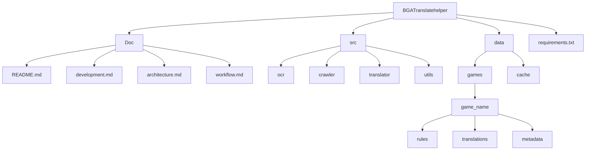

# BGA 翻译助手

这是一个用于辅助 Board Game Arena 平台游戏规则翻译的工具。

## 功能概述

1. OCR 识别：支持从游戏规则书中提取英文文本
2. 翻译管理：管理和组织游戏规则的翻译内容
3. 爬虫功能：自动获取 BGA 平台上的翻译内容
4. 翻译辅助：提供翻译建议和参考

## 目录结构

## 使用说明

1. 创建游戏目录：在 data/games/下创建新的游戏目录
2. 准备规则书：将规则书 PDF 放入对应游戏的 rules 目录
3. 运行 OCR：使用工具提取规则书中的英文文本
4. 获取翻译：使用爬虫获取 BGA 平台上的翻译内容
5. 进行翻译：参考已有翻译，完成剩余内容的翻译

## 开发计划

详见 [development.md](development.md)

## 系统架构

详见 [architecture.md](architecture.md)

## 工作流程

详见 [workflow.md](workflow.md)
