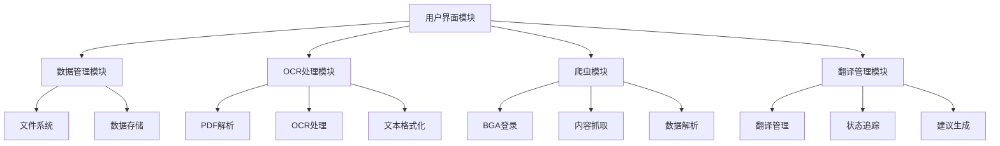
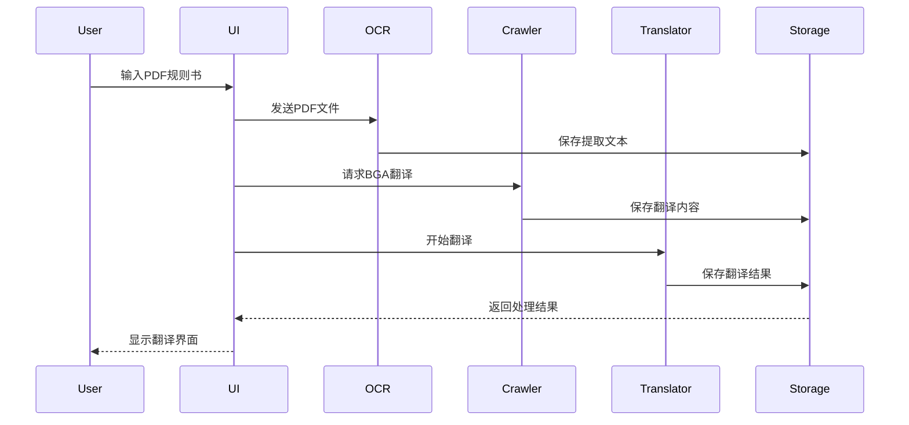
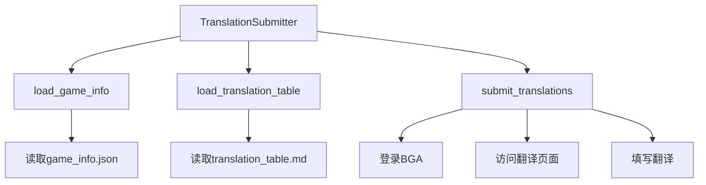

# 系统架构设计

## 整体架构

系统采用模块化设计，主要包含以下几个核心模块：

1. 数据管理模块
2. OCR 处理模块
3. 爬虫模块
4. 翻译管理模块
5. 用户界面模块



## 数据流



## 模块详细设计

### 1. 数据管理模块

#### 1.1 数据存储结构

```python
class GameData:
    def __init__(self, game_name):
        self.game_name = game_name
        self.rules = RulesManager()
        self.translations = TranslationManager()
        self.metadata = MetadataManager()
```

#### 1.2 文件系统管理

- 采用树形结构组织游戏数据
- 使用 JSON 格式存储元数据
- 使用 Markdown 格式存储翻译内容

### 2. OCR 处理模块

#### 2.1 核心组件

- Mistral OCR 集成
- PDF 解析器
- 文本格式化器

#### 2.2 处理流程

1. 接收 PDF 文件输入
2. 使用 OCR 提取文本
3. 格式化文本结构
4. 保存为 Markdown 格式

### 3. 爬虫模块

#### 3.1 核心功能

- BGA 网站登录
- 翻译内容抓取
- 数据解析和存储

#### 3.2 技术选型

- 使用 requests 处理 HTTP 请求
- 使用 BeautifulSoup 解析 HTML
- 使用 Selenium 处理动态内容

### 4. 翻译管理模块

#### 4.1 核心功能

- 翻译文件管理
- 翻译状态追踪
- 翻译建议生成
- 自动提交翻译

#### 4.2 数据结构

```python
class Translation:
    def __init__(self):
        self.original_text = ""
        self.translated_text = ""
        self.status = "pending"
        self.metadata = {}

class TranslationSubmitter:
    def __init__(self, game_name):
        self.game_name = game_name
        self.translator = BGATranslator()
        self.translations = {}
```

#### 4.3 提交流程

- 从 `game_info.json` 获取 `module_id`
- 从 `translation_table.md` 加载翻译内容
- 使用 Selenium 自动化提交翻译
- 提供详细的操作日志

#### 4.4 模块结构



### 5. 用户界面模块

#### 5.1 命令行界面

- 使用 argparse 处理命令行参数
- 提供交互式命令行界面
- 支持批处理操作

### 游戏元数据管理

- 位置：`data/games/<game_name>/metadata/game_info.json`
- 内容：完整的 BGA 游戏信息，包括：
  - 游戏基本信息（名称、描述、玩家人数等）
  - 游戏设置和选项
  - 游戏链接和资源
  - 翻译相关信息
- 用途：
  - 提供游戏基本信息，辅助翻译工作
  - 记录游戏设置和选项，确保翻译准确性
  - 保存游戏相关链接，方便参考
  - 跟踪翻译进度和状态

## 技术栈

- 编程语言：Python 3.8+
- 主要依赖：
  - Mistral OCR
  - requests
  - BeautifulSoup
  - Selenium
  - PyPDF2
  - markdown

## 错误处理

- 使用 try-except 处理异常
- 实现日志系统记录错误
- 提供错误恢复机制

## 性能考虑

- 使用缓存减少重复请求
- 实现异步处理提高效率
- 优化文件读写操作
