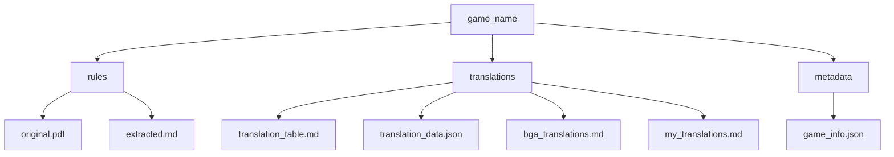
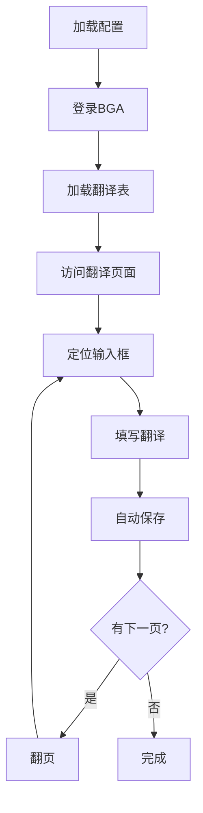

# 工作流程说明

## 1. 初始化新游戏

### 1.1 创建游戏目录

```bash
python -m src.main init-game <game_name>
```

### 1.2 目录结构



## 2. 获取游戏元数据

### 2.1 配置 BGA 账号

在 `.env` 文件中配置：
```ini
BGA_USERNAME=your_username
BGA_PASSWORD=your_password
```

### 2.2 获取游戏信息

```bash
python -m src.main fetch-game-info <game_name>
```

- 自动登录 BGA
- 获取游戏详细信息
- 保存到 `metadata/game_info.json`

## 3. 获取翻译内容

### 3.1 获取现有翻译

```bash
python -m src.main fetch-translation <game_name>
```

生成以下文件：
- `translation_table.md`：翻译对照表
- `translation_data.json`：结构化数据
- `bga_translations.md`：BGA 官方翻译
- `my_translations.md`：个人翻译

### 3.2 翻译对照表格式

```markdown
| 原文 | 翻译 |
|------|------|
| Original text | 中文翻译 |
```

## 4. 提交翻译

### 4.1 提交流程



### 4.2 运行提交脚本

```bash
python test_translation_submitter.py
```

自动执行：
1. 登录 BGA 账号
2. 导航到翻译页面
3. 定位翻译输入框
4. 填写翻译内容
5. 自动翻页继续处理
6. 自动保存内容

### 4.3 错误处理

如果遇到问题：
1. 检查日志文件 `translation.log`
2. 确认原文匹配
3. 验证网页元素可见性
4. 检查网络连接状态

### 4.4 最佳实践

- 先进行小范围测试
- 监控提交过程
- 定期检查翻译结果
- 保持合理的提交间隔

## 5. 调试和维护

### 5.1 日志文件

- 位置：项目根目录的 `translation.log`
- 包含：详细的执行步骤和错误信息
- 用途：排查问题和优化流程

### 5.2 环境配置

- `.env` 文件：存储账号信息
- `requirements.txt`：依赖管理
- Python 版本：3.8+

### 5.3 常见问题

1. 登录失败
   - 检查账号密码
   - 确认网络连接
   - 验证 BGA 站点可访问

2. 元素定位失败
   - 检查页面加载
   - 确认元素选择器
   - 验证元素可见性

3. 翻译未保存
   - 检查自动保存状态
   - 确认网络连接
   - 验证权限设置

## 6. 持续改进

- 收集用户反馈
- 优化自动化流程
- 提高翻译效率
- 完善错误处理
- 更新文档说明

## 注意事项

1. 定期备份数据
2. 保持 BGA 账号信息更新
3. 遵守 BGA 平台规则
4. 及时保存翻译进度
