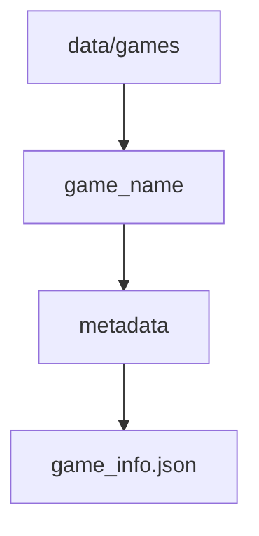
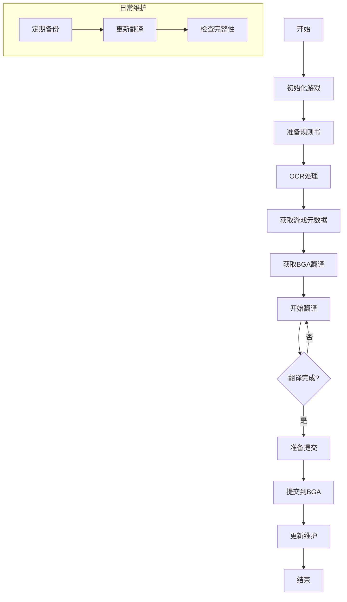

# 工作流程说明

## 1. 初始化新游戏

### 1.1 创建游戏目录

```bash
python main.py init-game <game_name>
```

### 1.2 目录结构


## 2. 规则书处理

### 2.1 准备规则书

1. 将规则书 PDF 放入 `rules/original.pdf`
2. 确保 PDF 清晰可读

### 2.2 运行 OCR

```bash
python main.py extract-text <game_name>
```

- 自动提取文本
- 保存到 `rules/extracted.md`

## 3. 获取游戏元数据

### 3.1 配置 BGA 账号

```bash
python main.py config-bga --username <username> --password <password>
```

### 3.2 获取游戏信息

```bash
python main.py fetch-game-info <game_name>
```

- 自动登录 BGA
- 获取游戏详细信息
- 保存到 `data/games/<game_name>/metadata/game_info.json`

### 3.3 文件结构



## 4. 获取 BGA 翻译

### 4.1 获取翻译

```bash
python main.py fetch-translations <game_name>
```

- 自动登录 BGA
- 抓取已有翻译
- 保存到 `translations/bga_translations.md`

## 5. 翻译工作

### 5.1 开始翻译

```bash
python main.py start-translation <game_name>
```

- 显示待翻译内容
- 提供已有翻译参考
- 支持实时保存

### 5.2 翻译界面


### 5.3 保存翻译

- 自动保存到 `translations/my_translations.md`
- 支持导出为其他格式

## 6. 提交翻译

### 6.1 准备提交

```bash
python main.py prepare-submission <game_name>
```

- 检查翻译完整性
- 生成提交格式

### 6.2 提交到 BGA

- 手动复制翻译内容
- 在 BGA 平台提交

## 7. 日常维护

### 7.1 更新翻译

```bash
python main.py update-translations <game_name>
```

- 获取最新 BGA 翻译
- 合并到本地文件

### 7.2 备份数据

```bash
python main.py backup <game_name>
```

- 创建数据备份
- 导出翻译历史

## 完整工作流程



## 注意事项

1. 定期备份数据
2. 保持 BGA 账号信息更新
3. 注意遵守 BGA 平台规则
4. 及时保存翻译进度
