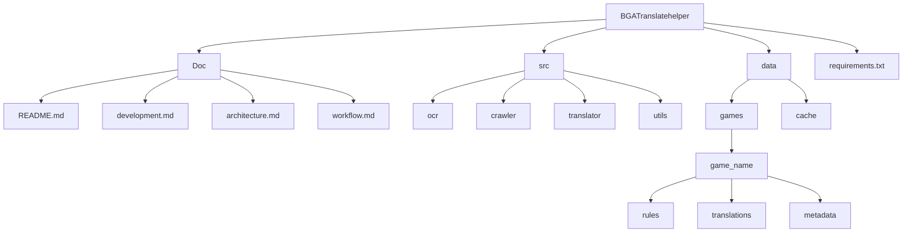

# BGA Translation Helper

[](https://opensource.org/licenses/MIT)
[](https://www.python.org/downloads/)

一个用于辅助 Board Game Arena 平台游戏规则翻译的工具。

## ✨ 功能特点

- 📄 OCR 识别：支持从游戏规则书中提取英文文本
- 🌐 翻译管理：管理和组织游戏规则的翻译内容
- 🕷️ 爬虫功能：自动获取 BGA 平台上的翻译内容
- 💡 翻译辅助：提供翻译建议和参考

## 🚀 快速开始

### 安装

```bash
# 克隆仓库
git clone https://github.com/yourusername/BGA-Translation-Helper.git
cd BGA-Translation-Helper

# 创建虚拟环境
python -m venv venv
source venv/bin/activate  # Linux/Mac
# 或
.\venv\Scripts\activate  # Windows

# 安装依赖
pip install -r requirements.txt
```

### 使用

1. 初始化新游戏：

```bash
python main.py init-game <game_name>
```

2. 准备规则书：

- 将规则书 PDF 放入 `data/games/<game_name>/rules/original.pdf`

3. 提取文本：

```bash
python main.py extract-text <game_name>
```

4. 获取 BGA 翻译：

```bash
python main.py fetch-translations <game_name>
```

5. 开始翻译：

```bash
python main.py start-translation <game_name>
```

## 📁 项目结构



## 📚 文档

- [开发计划](Doc/development.md)
- [系统架构](Doc/architecture.md)
- [工作流程](Doc/workflow.md)

## 🤝 贡献

欢迎提交 Issue 和 Pull Request！

## 📄 许可证

本项目采用 [MIT 许可证](LICENSE)。

## 🙏 致谢

- [Board Game Arena](https://boardgamearena.com/)
- [Mistral OCR](https://mistral.ai/)
